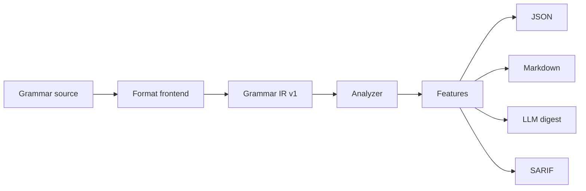

# How it works

Frontends understand source syntax. Everything after the Grammar IR boundary is format-independent.

## 1. Frontend

The frontend parses source files and returns a `GrammarIR` plus diagnostics. It records grammar structure, source identity, capabilities, locations, and references. It does not execute target code embedded in a grammar.

## 2. Grammar IR

Grammar IR is the versioned contract between format-specific code and the analyzer. The core validator checks its shape and canonical serialization makes stable output possible. See [Grammar IR](/reference/grammar-ir) for the fields and versioning rules.

## 3. Analyzer

The analyzer derives size, structure, precedence, lexicon, EBNF sugar, action presence, and capability-aware values. It also records diagnostics and `notApplicable` reasons where a metric does not make sense for a representation.

## 4. Reporters

JSON, Markdown, LLM digest, and SARIF reporters consume the same feature object. A report format changes presentation, not the underlying measurement.

## Determinism

Given the same source bytes, source identity, frontend, and options, the pipeline is designed to produce byte-stable canonical output. Explicit source names and `--source-root` make multi-file runs reproducible.
